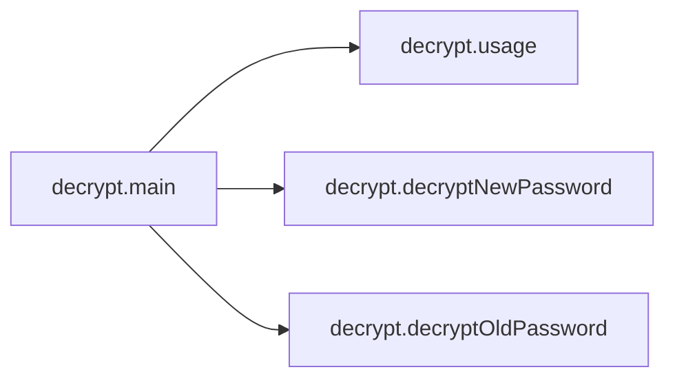

# Key Objects

[_Documentation generated by Documatic_](https://www.documatic.com)

<!---Documatic-section-decrypt.main-start--->
## decrypt.main

<!---Documatic-section-main-start--->


### Object Calls

* decrypt.usage
* decrypt.decryptNewPassword
* decrypt.decryptOldPassword

<!---Documatic-block-decrypt.main-start--->
<details>
	<summary><code>decrypt.main</code> code snippet</summary>

```python
def main():
    if len(sys.argv) != 4:
        usage()
    master_key = open(sys.argv[1], 'rb').read()
    hudson_secret_key = open(sys.argv[2], 'rb').read()
    hashed_master_key = sha256(master_key).digest()[:16]
    o = AES.new(hashed_master_key, AES.MODE_ECB)
    secret = o.decrypt(hudson_secret_key)
    secret = secret[:-16]
    secret = secret[:16]
    credentials = open(sys.argv[3]).read()
    passwords = re.findall('<p(?:assword|rivateKey)>\\{?(.*?)\\}?</p(?:assword|rivateKey)>', credentials)
    for password in passwords:
        p = base64.decodestring(bytes(password, 'utf-8'))
        payload_version = p[0]
        if payload_version == 1:
            print(decryptNewPassword(secret, p))
        else:
            print(decryptOldPassword(secret, p))
```
</details>
<!---Documatic-block-decrypt.main-end--->
<!---Documatic-section-main-end--->

# #
<!---Documatic-section-decrypt.main-end--->

<!---Documatic-section-decrypt.decryptOldPassword-start--->
## decrypt.decryptOldPassword

<!---Documatic-section-decryptOldPassword-start--->
<!---Documatic-block-decrypt.decryptOldPassword-start--->
<details>
	<summary><code>decrypt.decryptOldPassword</code> code snippet</summary>

```python
def decryptOldPassword(secret, p):
    o = AES.new(secret, AES.MODE_ECB)
    x = o.decrypt(p)
    assert MAGIC in x
    return re.findall('(.*)' + MAGIC, x)[0]
```
</details>
<!---Documatic-block-decrypt.decryptOldPassword-end--->
<!---Documatic-section-decryptOldPassword-end--->

# #
<!---Documatic-section-decrypt.decryptOldPassword-end--->

<!---Documatic-section-decrypt.decryptNewPassword-start--->
## decrypt.decryptNewPassword

<!---Documatic-section-decryptNewPassword-start--->
<!---Documatic-block-decrypt.decryptNewPassword-start--->
<details>
	<summary><code>decrypt.decryptNewPassword</code> code snippet</summary>

```python
def decryptNewPassword(secret, p):
    p = p[1:]
    iv_length = (p[0] & 255) << 24 | (p[1] & 255) << 16 | (p[2] & 255) << 8 | p[3] & 255
    p = p[4:]
    data_length = (p[0] & 255) << 24 | (p[1] & 255) << 16 | (p[2] & 255) << 8 | p[3] & 255
    p = p[4:]
    iv = p[:iv_length]
    p = p[iv_length:]
    o = AES.new(secret, AES.MODE_CBC, iv)
    decrypted_p = o.decrypt(p)
    fully_decrypted_blocks = decrypted_p[:-16]
    possibly_padded_block = decrypted_p[-16:]
    padding_length = possibly_padded_block[-1]
    if padding_length <= 16:
        possibly_padded_block = possibly_padded_block[:-padding_length]
    pw = fully_decrypted_blocks + possibly_padded_block
    pw = pw.decode('utf-8')
    return pw
```
</details>
<!---Documatic-block-decrypt.decryptNewPassword-end--->
<!---Documatic-section-decryptNewPassword-end--->

# #
<!---Documatic-section-decrypt.decryptNewPassword-end--->

<!---Documatic-section-decrypt.usage-start--->
## decrypt.usage

<!---Documatic-section-usage-start--->
<!---Documatic-block-decrypt.usage-start--->
<details>
	<summary><code>decrypt.usage</code> code snippet</summary>

```python
def usage():
    print('./decrypt.py <master.key> <hudson.util.Secret> <credentials.xml>')
    sys.exit(0)
```
</details>
<!---Documatic-block-decrypt.usage-end--->
<!---Documatic-section-usage-end--->

# #
<!---Documatic-section-decrypt.usage-end--->

[_Documentation generated by Documatic_](https://www.documatic.com)